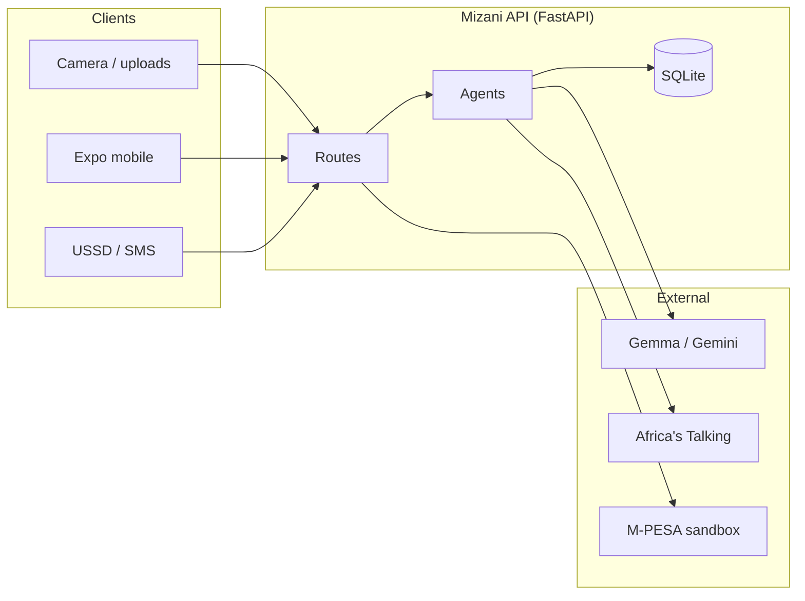
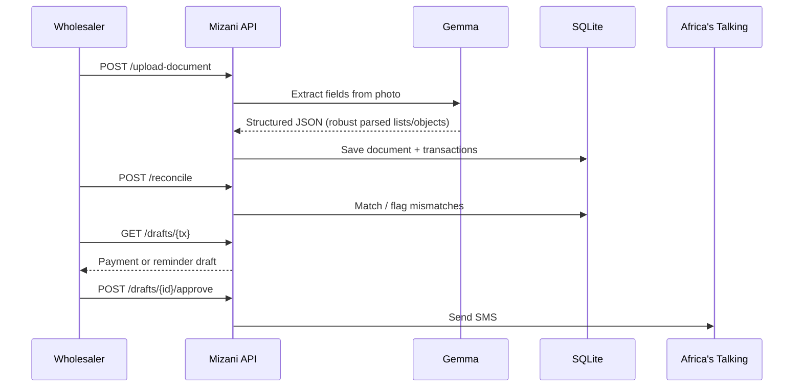
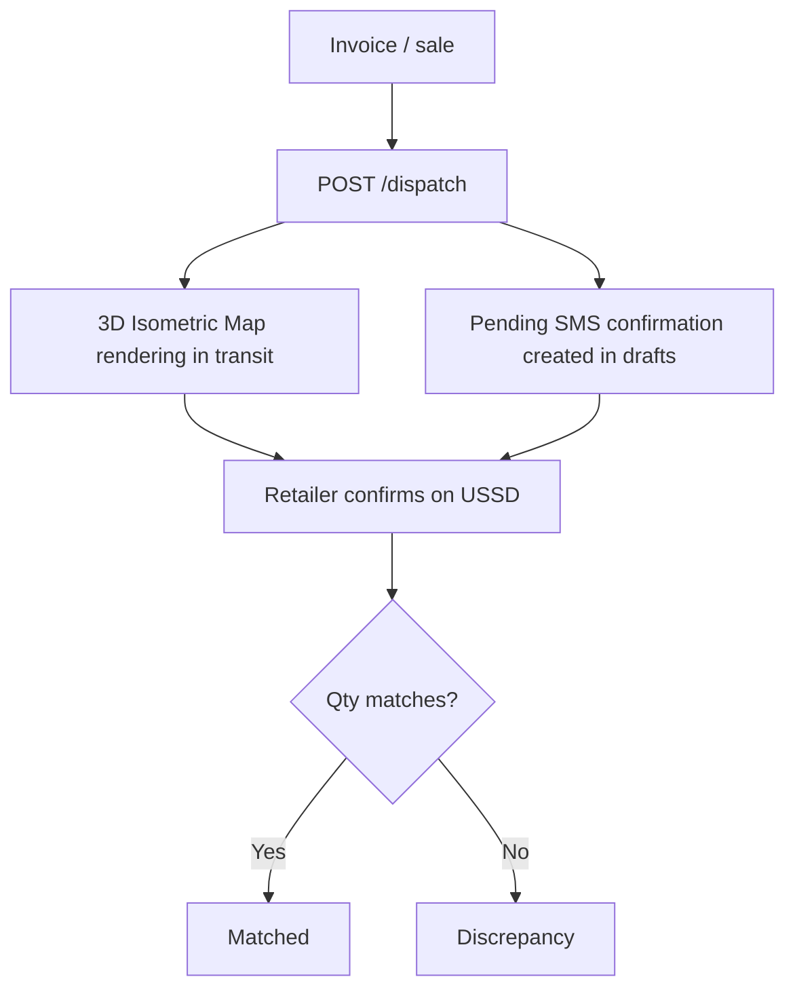

# Mizani

**When stock, invoices, and M-PESA finally balance.**

Mizani helps Kenyan wholesalers keep books *sawa* — photo a document, reconcile money and stock, chase payables over SMS/USSD, and see the business pulse on mobile.

| Client | Who uses it |
|---|---|
| **Expo app** (`mobile/`) | Wholesaler — intake, analytics, live 3D stock trail tracking, draft approvals |
| **USSD / SMS** | Retailers & drivers — balance check, delivery confirm, reminders |

---

## Redesigned Visual Experience

The mobile client is built on a **Modern Dark** design system, prioritizing clean visual hierarchy, readability, and modern aesthetics tailored for fast-paced wholesale operations:
- **Design Dial Density (7/10):** Information-dense dashboards with micro-interactions, spring mechanics, and responsive feedback.
- **Color tokens:** Brand forest green and gold trust accents layered over high-contrast cinema surfaces.
- **Typography:** Google Fonts Inter throughout.
- **Icons:** Fully vector-based icons via `@expo/vector-icons` (Ionicons) — no structural emojis.

---

## Core Capabilities

| Capability | What happens |
|---|---|
| **Ingest** | Photo invoices, statements → Gemma extracts structured transactions. |
| **Reconcile** | Match payables ↔ receivables / statements; flag mismatches. |
| **Action Inbox** | Approve SMS drafts (generated automatically on dispatch or reconciliation) to send via Africa's Talking. |
| **Stock Trail** | Three-way match: invoice ↔ dispatch ↔ retailer USSD receipt. |
| **3D Live Tracking** | Interactive isometric 3D route map rendering for dispatched orders in transit. |
| **M-PESA** | Sandbox “Connect → Sync” pulls fixture txs into the same ledger. |
| **Pulse** | LLM-generated business update narratives + analytics dashboard widgets. |

---

## Architecture



---

## Core Money Flow



---

## Stock Trail & 3D Isometric Route Tracking

Once a warehouse dispatch is photographed and uploaded, a **live 3D isometric map** renders in the Expo app under **Goods**, tracing the order's route to the destination shop. Simultaneously, a pending confirmation message is automatically drafted in the **Inbox**.



---

## Quick Start

### Backend

```bash
python -m venv .venv
# Activate: source .venv/bin/activate (Linux/Mac) or .venv\Scripts\activate (Windows)
source .venv/bin/activate
pip install -r requirements.txt
cp .env.example .env
# Fill GEMMA_API_KEY and AT_API_KEY (AT_USERNAME=sandbox)
uvicorn main:app --reload --host 0.0.0.0 --port 8000
```

Seed ledger fixtures:

```bash
python sample_data/seed_demo_for_app.py
```

### Mobile (Expo)

Ensure you run Metro on a clean port and compile for Web or Native:

```bash
cd mobile
npm install
cp .env.example .env
# Set EXPO_PUBLIC_API_URL to http://localhost:8000 (simulator)
# or your ngrok host (physical device)
npx expo start
```

Press **`w`** in the terminal window to run in your local web browser.

### USSD (Africa's Talking sandbox)

1. Expose the API with ngrok: `ngrok http 8000`
2. Create a USSD channel; callback URL = `https://<ngrok-host>/ussd`
3. Dial `*<service>*<channel>#` in the AT simulator (e.g. `*384*51567#`)

Menu options: check balance, confirm delivery quantity, exit.

---

## API Map

```mermaid
mindmap
  root((Mizani))
    Documents
      POST /upload-document
      POST /reconcile
    Drafts
      GET /drafts/{tx}
      POST /drafts/{id}/approve
    Channels
      POST /ussd
      GET /digest
    Stock
      POST /dispatch
      GET /deliveries/{tx}
    M-PESA
      POST /mpesa/connect
      POST /mpesa/sync
      GET /mpesa/status
    Analytics
      GET /analytics/overview
      GET /analytics/counterparties
      GET /analytics/inbox
      GET /analytics/goods
```

---

## Project Layout

```
agents/          # Ingestion, reconcile, payables, stock, digest, M-PESA, analytics
channels/        # Africa's Talking SMS / USSD client
db/              # Schema, migrations, SQLite helpers
routes/          # FastAPI endpoints
mobile/          # Expo (React Native) wholesaler client
sample_data/     # Fixtures + seed scripts
tests/           # pytest
```

---

## Demo Script

1. **Seed:** Run `python sample_data/seed_demo_for_app.py`.
2. **Pulse:** Open the mobile screen to view the LLM narrative of the week.
3. **Money:** Sync local sandbox transactions or upload a statement.
4. **Inbox:** Run reconciliation on mismatches and approve automatic SMS notification drafts.
5. **Goods:** Photograph a dispatch. The item moves into "In Transit", displaying the **3D Order Route map**.
6. **USSD:** Confirm delivery receipt in USSD, updating the match status to complete the loop.
