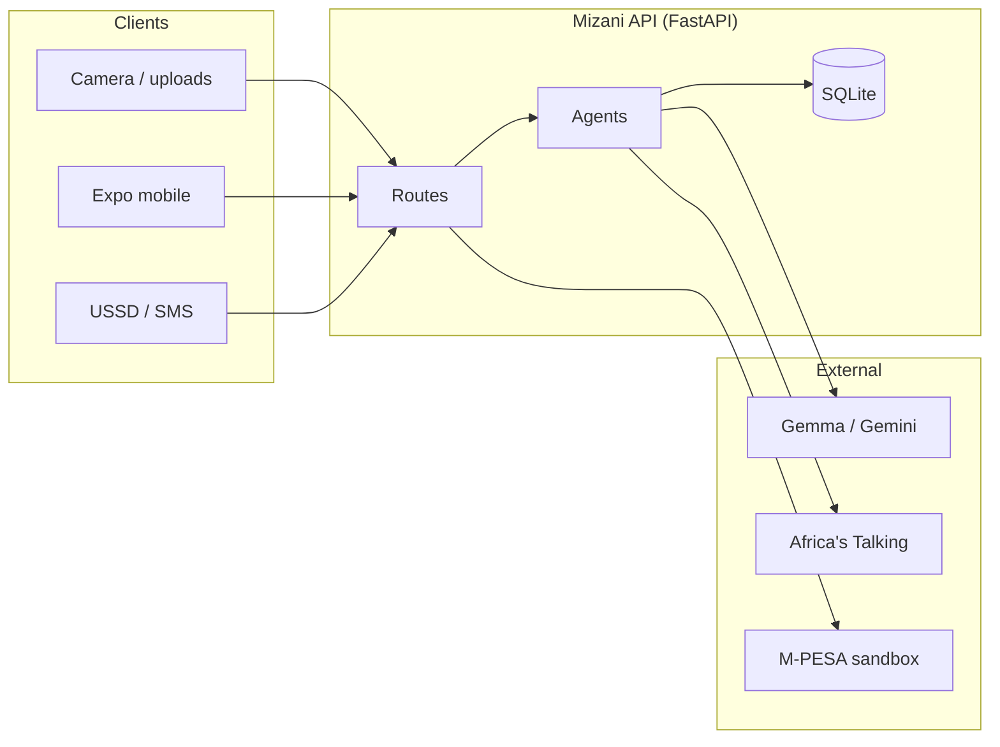
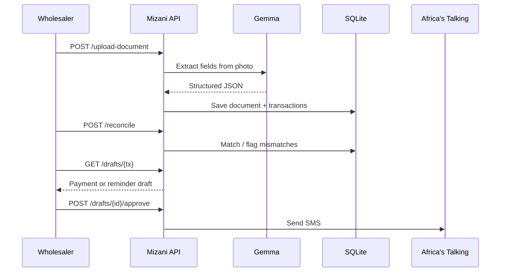
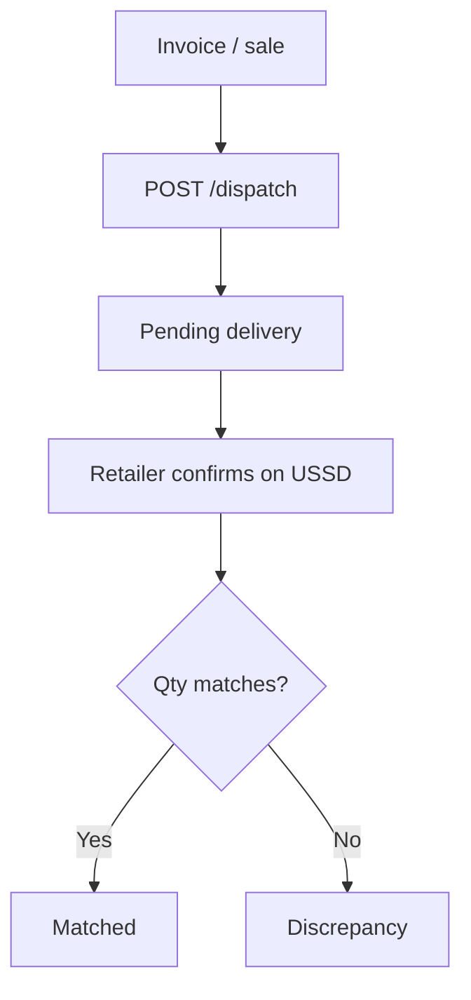

# Mizani

**When stock, invoices, and M-PESA finally balance.**

Mizani helps Kenyan wholesalers keep books *sawa* — photo a document, reconcile money and stock, chase payables over SMS/USSD, and see the business pulse on mobile.

| Client | Who uses it |
|---|---|
| **Expo app** (`mobile/`) | Wholesaler — intake, analytics, stock trail, draft approvals |
| **USSD / SMS** | Retailers & drivers — balance check, delivery confirm, reminders |

## What it does

| Capability | What happens |
|---|---|
| **Ingest** | Photo invoices, delivery notes, bank statements → Gemma extracts structured transactions |
| **Reconcile** | Match payables ↔ receivables / statements; flag mismatches |
| **Act** | Draft payment & reminder SMS; approve to send via Africa's Talking |
| **Stock trail** | Three-way match: invoice ↔ dispatch ↔ retailer USSD receipt |
| **M-PESA** | Sandbox “Connect → Sync” pulls fixture txs into the same ledger |
| **Pulse** | Digests + analytics narrative for the Expo app |

## Architecture



## Core money flow



## Stock trail



## Quick start

### Backend

```bash
python -m venv .venv
# Windows: .venv\Scripts\activate
pip install -r requirements.txt
cp .env.example .env
# Fill GEMMA_API_KEY and AT_API_KEY (AT_USERNAME=sandbox)
uvicorn main:app --reload --host 0.0.0.0 --port 8000
```

Seed demo ledger + M-PESA fixture + contacts (recommended before the mobile demo):

```bash
python sample_data/seed_demo_for_app.py
```

API docs: [http://localhost:8000/docs](http://localhost:8000/docs) · Health: `GET /health`

### Mobile (Expo)

```bash
cd mobile
npm install
cp .env.example .env
# Set EXPO_PUBLIC_API_URL to http://localhost:8000 (simulator)
# or your ngrok host (physical device) — same host as USSD, no /ussd path
npx expo start
```

Tabs: **Pulse** · **Money** · **People** · **Goods** · **Inbox** — see [`mobile/README.md`](mobile/README.md).

### Tests

```bash
pytest
```

### USSD (Africa's Talking sandbox)

1. Expose the API with ngrok: `ngrok http 8000`
2. Create a USSD channel; callback URL = `https://<ngrok-host>/ussd`
3. Dial `*<service>*<channel>#` in the AT simulator (e.g. `*384*51567#`)

Menu: check what I owe · confirm delivery received · exit.

## Environment

| Variable | Where | Purpose |
|---|---|---|
| `GEMMA_API_KEY` | root `.env` | Gemma/Gemini (OpenAI-compatible) |
| `GEMMA_BASE_URL` / `GEMMA_MODEL` | root `.env` | Endpoint + model id |
| `AT_USERNAME` / `AT_API_KEY` | root `.env` | Africa's Talking sandbox (`sandbox` + key) |
| `DATABASE_PATH` | root `.env` | SQLite file (default `mizani.db`) |
| `UPLOAD_DIR` | root `.env` | Uploaded photos |
| `EXPO_PUBLIC_API_URL` | `mobile/.env` | FastAPI base URL for the app |

## API map

```mermaid
mindmap
  root((Mizani))
    Documents
      POST /upload-document
      POST /reconcile
    Drafts
      GET /drafts/{tx}
      POST /drafts/{id}/approve
    Channels
      POST /ussd
      GET /digest
    Stock
      POST /dispatch
      GET /deliveries/{tx}
    M-PESA
      POST /mpesa/connect
      POST /mpesa/sync
      GET /mpesa/status
    Analytics
      GET /analytics/overview
      GET /analytics/counterparties
      GET /analytics/inbox
      GET /analytics/goods
```

## Project layout

```
agents/          # Ingestion, reconcile, payables, stock, digest, M-PESA, analytics
channels/        # Africa's Talking SMS / USSD client
db/              # Schema, migrations, SQLite helpers
routes/          # FastAPI endpoints
mobile/          # Expo (React Native) wholesaler client
sample_data/     # Fixtures + seed scripts
tests/           # pytest
```

## Stack

**FastAPI · SQLite · Gemma/Gemini · Africa's Talking · M-PESA sandbox · Expo**

## Demo script

1. Seed: `python sample_data/seed_demo_for_app.py`
2. Open mobile **Pulse** — Gemma narrative + money in/out
3. **Money** — Connect M-PESA → Sync (or photograph a statement)
4. **Inbox** — reconcile mismatches; approve a reminder draft (SMS in AT sandbox)
5. **Goods** — dispatch photo; retailer confirms on USSD; three-way match updates
6. Dial USSD — “Check what I owe” with a seeded contact phone
