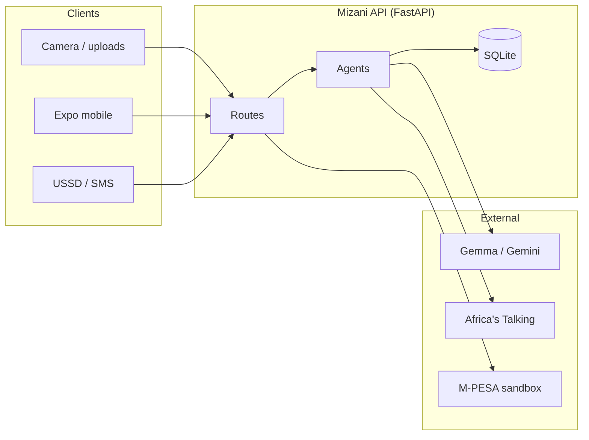
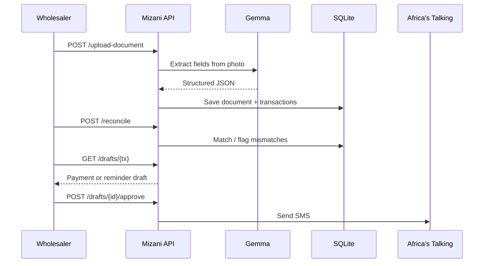
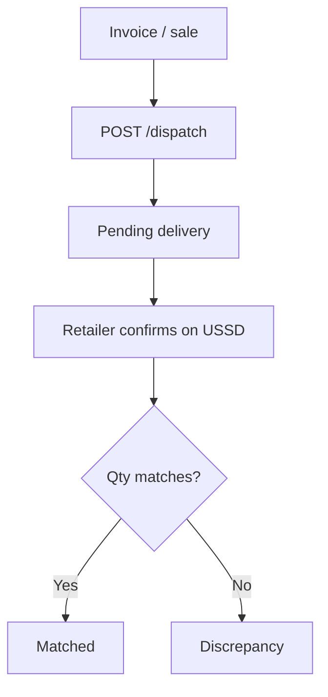

# Mizani

**When stock, invoices, and M-PESA finally balance.**

Mizani helps Kenyan wholesalers keep books *sawa* — photo a document, reconcile money and stock, chase payables over SMS/USSD, and see the business pulse on mobile.

## What it does

| Capability | What happens |
|---|---|
| **Ingest** | Photo invoices, delivery notes, bank statements → Gemma extracts structured transactions |
| **Reconcile** | Match payables ↔ receivables / statements; flag mismatches |
| **Act** | Draft payment & reminder SMS; approve to send via Africa's Talking |
| **Stock trail** | Three-way match: invoice ↔ dispatch ↔ retailer USSD receipt |
| **M-PESA** | Sandbox sync into the same ledger |
| **Pulse** | Digests + analytics for the Expo mobile app |

## Architecture



## Core money flow



## Stock trail



## Quick start

```bash
# Backend
python -m venv .venv
# Windows: .venv\Scripts\activate
pip install -r requirements.txt
cp .env.example .env   # add GEMMA_API_KEY, AT_API_KEY
uvicorn main:app --reload --host 0.0.0.0 --port 8000
```

```bash
# Mobile
cd mobile
npm install
# set EXPO_PUBLIC_API_URL in mobile/.env
npx expo start
```

```bash
# Tests
pytest
```

API docs: [http://localhost:8000/docs](http://localhost:8000/docs) · Health: `GET /health`

## API map

```mermaid
mindmap
  root((Mizani))
    Documents
      POST /upload-document
      POST /reconcile
    Drafts
      GET /drafts/{tx}
      POST /drafts/{id}/approve
    Channels
      POST /ussd
      GET /digest
    Stock
      POST /dispatch
      GET /deliveries/{tx}
    M-PESA
      POST /mpesa/connect
      POST /mpesa/sync
      GET /mpesa/status
    Analytics
      GET /analytics/overview
      GET /analytics/counterparties
      GET /analytics/inbox
      GET /analytics/goods
```

## Project layout

```
agents/          # Ingestion, reconcile, payables, stock, digest, M-PESA, analytics
channels/        # Africa's Talking SMS / USSD client
db/              # Schema, migrations, SQLite helpers
routes/          # FastAPI endpoints
mobile/          # Expo (React Native) client
sample_data/     # Fixtures + seed scripts
tests/           # pytest
```

## Stack

**FastAPI · SQLite · Gemma/Gemini · Africa's Talking · M-PESA sandbox · Expo**
